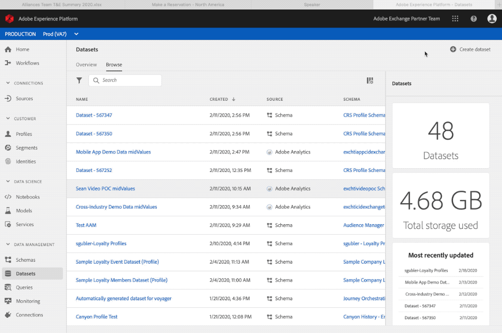

# 스키마 및 데이터 세트 만들기

다음 [Postman 컬렉션](https://github.com/Adobe-Marketing-Cloud/exchange-aep-profile-integration-postman) 는 연결된 번호로 호출을 사용하여 문서 전체에서 참조됩니다. Postman 컬렉션 설치 및 사용에 대한 자세한 내용은 Github에서 확인할 수 있습니다 [추가 정보](https://github.com/Adobe-Marketing-Cloud/exchange-aep-profile-integration-postman/blob/master/README.md) 페이지를 가리키도록 업데이트하는 중입니다. 다음 샘플 데이터 세트도 있습니다. [충성도](https://github.com/Adobe-Marketing-Cloud/exchange-aep-profile-integration-postman/blob/master/AEP%20loyalty%20events.json) 및 [프로필](https://github.com/Adobe-Marketing-Cloud/exchange-aep-profile-integration-postman/blob/master/AEP%20loyalty%20profiles.json) 데이터.

## 스키마

스키마는 데이터의 구조와 형식을 나타내고 유효성을 검사하는 규칙 세트입니다. 스키마는 높은 수준에서 실제 개체(예: 사람)에 대한 추상적인 정의를 제공하고, 해당 개체의 각 인스턴스에 포함되어야 하는 데이터(예: 이름, 성, 생일 등)에 대한 개요를 제공합니다. UI에서 또는 를 사용하여 스키마를 생성할 수 있습니다. [!DNL Experience Platform] API.

다음을 참조하십시오 [이 설명서](https://www.adobe.io/apis/experienceplatform/home/xdm/xdmservices.html#!api-specification/markdown/narrative/technical_overview/schema_registry/schema_composition/schema_composition.md) 을 참조하십시오.

### 스키마 만들기

파트너는 다음을 통해 UI를 사용하여 스키마를 작성할 수 있습니다. [튜토리얼](https://docs.adobe.com/content/help/ko-KR/experience-platform/xdm/tutorials/create-schema-ui.html). 이 예에서는 충성도 프로그램 프로필 스키마를 사용합니다. 이 예는 프로필 스키마이지만 유사한 프로세스를 사용하여 이벤트 기반 스키마를 사용할 수 있습니다.

API를 사용하려면 파트너에게 와 기존 Adobe I/O 통합이 있어야 합니다. [!DNL Experience Platform] 사용 권한이 활성화되었습니다. 다음 안내서를 참조하십시오. [I/O 통합 생성](https://www.adobe.io/apis/experienceplatform/home/tutorials/alltutorials.html#!api-specification/markdown/narrative/tutorials/authenticate_to_acp_tutorial/authenticate_to_acp_tutorial.md).

다음 방문 [이 링크](https://docs.adobe.com/content/help/en/experience-platform/xdm/tutorials/create-schema-api.html) api를 사용하여 스키마를 구축하는 방법을 알아봅니다.

Postman을 통해 스키마를 생성하려면 폴더에 포함된 호출 1: 스키마 만들기, 1a: 프로필 데이터에 대한 스키마 만들기 또는 1b: 이벤트 데이터에 대한 스키마 만들기 를 사용합니다.

## 데이터 세트

Adobe으로 가져오는 모든 데이터 [!DNL Experience Platform] 는 데이터 세트에 포함되어 있습니다. 데이터 세트는 스키마(열) 및 필드(행)를 포함하는 데이터 수집을 위한 저장소 및 관리 구조입니다. 데이터 세트에는 저장하는 데이터의 다양한 측면을 설명하는 메타데이터도 포함됩니다.

카탈로그 서비스는 데이터 위치 및 내부 계보에 대한 레코드 시스템입니다. [!DNL Experience Platform]및 를 사용하여 데이터 세트를 만들고 관리할 수 있습니다. 카탈로그는 각 데이터 세트에 대한 메타데이터를 추적하며, 여기에는 데이터 세트가 준수하는 XDM(Experience Data Model) 스키마에 대한 참조(다음 섹션에 설명)와 해당 데이터 세트에 수집된 레코드 수가 포함됩니다.

이동 [여기](https://docs.adobe.com/content/help/en/experience-platform/catalog/datasets/overview.html) 을 참조하십시오.

### 데이터 세트 만들기

<!-- 
We don't yet support hover text in images (and we render it poorly when included). I removed "Creating a Dataset" from the above image link. We can add it back when we support it (Summer 2020?) -Bob
-->

UI를 통해 데이터 세트를 만듭니다.

1. 클릭 **[!UICONTROL 데이터 세트 만들기]**.

1. 클릭 **[!UICONTROL 스키마에서 만들기]**.

1. **[!UICONTROL 마침을 클릭합니다]**.

이동 [여기](https://docs.adobe.com/content/help/en/experience-platform/catalog/datasets/user-guide.html) 데이터 세트 사용 안내서용입니다.

[API를 사용하여 데이터 세트 만들기](https://docs.adobe.com/content/help/en/experience-platform/catalog/datasets/create.html).

Postman을 통해 데이터 세트를 만들려면 폴더 2: 데이터 세트 만들기, 2a: 프로필 데이터에 대한 데이터 세트 만들기 또는 2b: 이벤트 데이터에 대한 데이터 세트 만들기 를 사용합니다.

## 파트너를 위한 스키마 및 데이터 세트 모범 사례

* 파트너 데이터는 별도의 프로필 스키마를 사용해야 하며, 고객의 기존 프로필 스키마 및 경험 스키마에 대한 믹스인을 만들어야 합니다.
* 파트너는 가능한 경우 Adobe 클래스와 믹스인을 사용해야 합니다.
* 파트너는 데이터를 기존 데이터 세트에 결합하는 대신 별도의 데이터 세트를 사용하여 데이터를 업로드해야 합니다.
* 파트너는 현재 전역 레지스트리에 스키마를 업로드할 수 없습니다.
